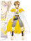

# JavaScript Capstone Project: Build an RPG game

<h1 align="center">Ultimate Ninja</h1>
 

[![Contributors][contributors-shield]][contributors-url]
[![Issues][issues-shield]][issues-url]
 

This is [Microverse's](https://www.microverse.org/) final project for the Javascript section.

In this project I implemented an RPG game using [Phaser 3](http://phaser.io/tutorials), an open-source framework for Canvas and WebGL powered browser games.
This project's objective was to build a platform game similar [GameDev Academy](https://gamedevacademy.org/how-to-create-a-turn-based-rpg-game-in-phaser-3-part-1/).The main objective was to use the tutorial create my own role play game.

Assignment [Link](https://www.notion.so/RPG-game-f94a617841e240a293c0b6928beebe89).

## ✨ Live link
[link](https://ultimate-ninja.netlify.app/)

## How to play the game
- Enter your name and click on the start button

- You will be directed to the game menu

- If you select play, you will be directed to the worldScene.

- Use the left, right, up and down arrows  to navigate through the scene and look for the enemies. Once you find them, you shall be directed to the battle scene to fight with the found enemies.

- You will then be directed to the battle scene and here you will fight against two enemies in each round.
- You will use the arrows still to dodge the attacks and the space bar to launch attack
- Enjoy

## Design and thinking
This is a turn based role play game. The objective of this game is to give players a chance to enjoy a fun but also leveling game to give them a feel of progression and at the same time challenge as they fight the different characters dubbed as enemies.

This is how I designed my game: 
- In the first two days, I had a lot of ideas for a game in my mind. I thought of creating this cool 3D game with characters fighting but I ended up creating a game where there are two game characters on one side fighting enemies on the other side. 
- I however, lost sometime in between and when I was able to catchup, I continued with the design process. 
- I decided to name my game Ultimate Ninja because the name sounded cool for a turn based game especially with characters fighting.
- I used the available sprites, images and sounds from [openGame Art](https://opengameart.org)

The game comprises of two scenes. That is the World Scene which has one player. To navigate through this scene, a player has to use the arrows  to navigate through this scene. During the design process, my thinking was that the enemies are hiding and the player has to navigate through to look for them.

The battle Scene is where the action takes place and to dodge attack, we still use  arrows. 

The more the levels you win, the higher the score!.

#### players-characters

These are your player characters and you will interact with them very often.

##### Prospector
You will find this one in the worldScene and he is the one you will use to look for the enemies.

##### Ninja 
This is your most powerful player and you ought to guard him well. He hits the enemy with a damage of **150** and **80 Hp**

##### Herus 
This one is your weakest  and only hits with **50 damage** and **200 Hp**. But he can also handle more attack from the enemy than **Ninja**

#### Enemies
These are the characters that you are fighting against.

##### wizarus form 1 

You will meet him in level one of this game. He has **80 damage** and **80 Hp**. He takes more than one shape so lookout!

##### wizarus form 2 
You will also meet him in level one but its also possible to meet him in level two. He has **90 damage** and **90 Hp**

##### wizarus form 3 

You will meet him in level two and he is more powerful than the first two enemies  **110 damage** and **100 Hp**

##### ghostus 

You will find him in level 3 of this game. He is very powerful with  **120 damage** and **150 Hp**

##### Master 

This is the strongest and most powerful of all the enemies so you will definately want to defeat him! He has **150 damage** and **200 Hp**

## Technologies used
* HTML and CSS
* JavaScript
* Phaser 3
* Webpack
* Eslint
* Babel
* Jest for testing the game
* Github
* [Netlify](https://app.netlify.com/) for the deployment
* [Leaderboard API service](https://www.notion.so/Leaderboard-API-service-24c0c3c116974ac49488d4eb0267ade3) for the leaderboard

## Project Setup
- To use this project, clone this repositoy by running
~~~ 
$git clone https://github.com/ampaire/phaserRPG.git 
~~~
- To install technologies used for this project, run
~~~
$npm install
~~~
- Then run
~~~
$npm run build
~~~
- Finally run
~~~
$npm run start
~~~
And you will be directed to the port where your project is cureently runing

## Skills

### Tools

* Use linters (code standards) ![mast][mast]
* Maintain professional Github repos ![mast][mast]
* Deploy apps (Heroku or Netlify) ![mast][mast]

### Soft skills

* Strong English written communication ![mast][mast]
* Ability to communicate information effectively to non-technical people ![mast][mast]
* Ability to translate business requirements into software solutions ![mast][mast]
* Sets high standards of performance to oneself ![mast][mast]
* Shows a desire to take personal responsibility to complete tasks and solve problems ![mast][mast]
* Ability to multitask and effectively manage time and prioritization ![mast][mast]

### Technical skills

* Create effective JavaScript code that solves the problem ![mast][mast]
* Encapsulate JS code in modules ![mast][mast]
* Use Webpack ![mast][mast]
* Use EcmaScript+ ![mast][mast]
* Deal with async code ![mast][mast]
* Send and receive data from a back-end endpoint ![mast][mast]
* Use JSON format ![mast][mast]
* Use DOM (read/write data) listen to events ![mast][mast]
* Test JS code ![mast][mast]

Overall Grade ![mast][mast]

## Developer

👤 ** Phemia Ampaire**

- Github: [@ampaire](https://github.com/ampaire)
- Twitter: [@AmpaPhem](https://twitter.com/AmpaPhem)
- Linkedin: [linkedin](https://linkedin.com/ampaire-phemia)

## 🤝 Contributing

Contributions, issues and feature requests are welcome!

You can open a new issue on the [issues page](https://github.com/ampaire/phaserRPG/issues).

## Show your support

Give a ⭐️ if you like this project!

<!-- MARKDOWN LINKS & IMAGES -->
<!-- https://www.markdownguide.org/basic-syntax/#reference-style-links -->
[contributors-shield]: https://img.shields.io/badge/Contributors-1-%2300ff00
[contributors-url]: https://github.com/ampaire/phaserRPG/graphs/contributors
[issues-shield]: https://img.shields.io/badge/issues-0-%2300ff00
[issues-url]: https://github.com/ampaire/phaserRPG/issues/
[mast]: https://raw.githubusercontent.com/ampaire/phaserRPG/feature/build/assets/grade/masteryBadge.png

# Acknowledgements
- [Game Dev Academy](https://gamedevacademy.org/how-to-create-a-turn-based-rpg-game-in-phaser-3-part-1/)
- [openGame Art](https://opengameart.org)
- [Leaderboard API service](https://www.notion.so/Leaderboard-API-service-24c0c3c116974ac49488d4eb0267ade3)
- My mentor at Microverse - [Thais Viera](https://github.com/thsvr)